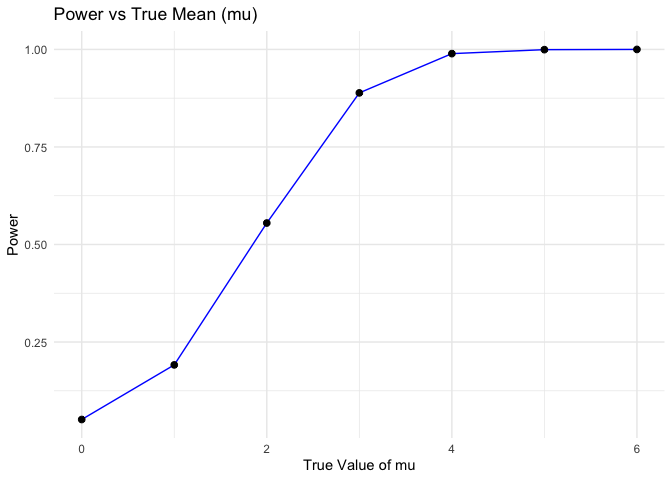
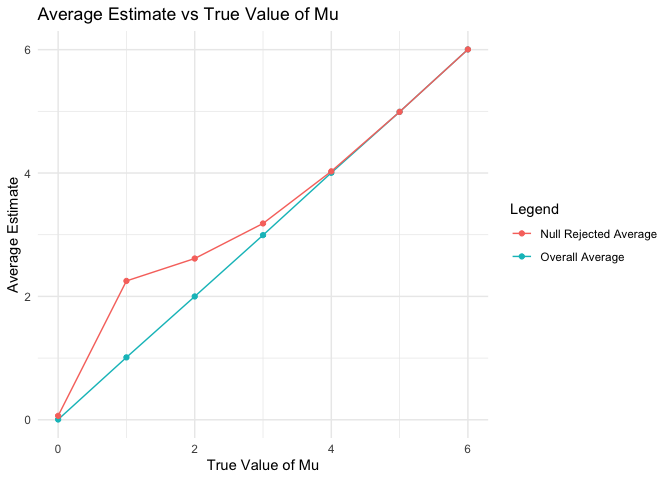
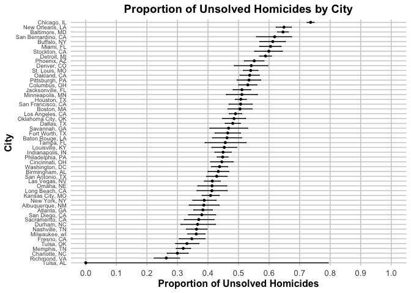

p8105_hw5_xw2961
================
`Nov 15`

# Loading packages

``` r
 library(tidyverse)
```

    ## ── Attaching core tidyverse packages ──────────────────────── tidyverse 2.0.0 ──
    ## ✔ dplyr     1.1.4     ✔ readr     2.1.5
    ## ✔ forcats   1.0.0     ✔ stringr   1.5.1
    ## ✔ ggplot2   3.5.1     ✔ tibble    3.2.1
    ## ✔ lubridate 1.9.3     ✔ tidyr     1.3.1
    ## ✔ purrr     1.0.2     
    ## ── Conflicts ────────────────────────────────────────── tidyverse_conflicts() ──
    ## ✖ dplyr::filter() masks stats::filter()
    ## ✖ dplyr::lag()    masks stats::lag()
    ## ℹ Use the conflicted package (<http://conflicted.r-lib.org/>) to force all conflicts to become errors

``` r
  library(dplyr)
  library(tidyr)
  library(ggplot2)
```

# Problem 2

``` r
# Set Parameters
n <- 30  # Sample size
sigma <- 5  # Standard deviation
mu_values <- c(0, 1, 2, 3, 4, 5, 6)  # True mean values
num_simulations <- 5000  # Number of iterations
alpha <- 0.05  # Significance level

# Create Simulator Function
sim_func <- function(mu, sample_size, population_std) {
  # Simulate data
  data <- rnorm(sample_size, mean = mu, sd = population_std)
  
  # Perform t-test and tidy results
  t_test <- broom::tidy(t.test(data, mu = 0)) %>%
    select(estimate, p.value)
  
  return(t_test)
}

# Perform Simulations
sim_df <- expand_grid(
  mu = mu_values,
  iteration = 1:num_simulations
) %>%
  mutate(result = map(mu, ~ sim_func(mu = .x, sample_size = n, population_std = sigma))) %>%
  unnest(result)  # Combine results into a single data frame

# Group by mu and calculate power
power_results <- sim_df %>%
  group_by(mu) %>%
  summarize(
    power = mean(p.value < alpha)  # Proportion of null hypothesis rejections
  )

# Plot Power vs True Mean
library(ggplot2)

ggplot(power_results, aes(x = mu, y = power)) +
  geom_line(color = "blue") +
  geom_point(size = 2) +
  labs(
    title = "Power vs True Mean (mu)",
    x = "True Value of mu",
    y = "Power"
  ) +
  theme_minimal()
```

<!-- -->

``` r
# Calculate averages
average_results <- sim_df %>%
  group_by(mu) %>%
  summarize(
    avg_mu_hat = mean(estimate),  # Overall average of sample means
    avg_rejected_mu_hat = mean(estimate[p.value < alpha], na.rm = TRUE)  # Average sample mean for null rejected
  )

# Plot overall average and null rejected average
ggplot(average_results, aes(x = mu)) +
  geom_line(aes(y = avg_mu_hat, color = "Overall Average")) +
  geom_point(aes(y = avg_mu_hat, color = "Overall Average")) +
  geom_line(aes(y = avg_rejected_mu_hat, color = "Null Rejected Average")) +
  geom_point(aes(y = avg_rejected_mu_hat, color = "Null Rejected Average")) +
  labs(
    title = "Average Estimate vs True Value of Mu",
    x = "True Value of Mu",
    y = "Average Estimate",
    color = "Legend"
  ) +
  theme_minimal()
```

<!-- --> \#
Problem 3

``` r
# Loading the dataset
data_url <- "https://raw.githubusercontent.com/washingtonpost/data-homicides/master/homicide-data.csv"

homicides_data <- read_csv(data_url)
```

    ## Rows: 52179 Columns: 12
    ## ── Column specification ────────────────────────────────────────────────────────
    ## Delimiter: ","
    ## chr (9): uid, victim_last, victim_first, victim_race, victim_age, victim_sex...
    ## dbl (3): reported_date, lat, lon
    ## 
    ## ℹ Use `spec()` to retrieve the full column specification for this data.
    ## ℹ Specify the column types or set `show_col_types = FALSE` to quiet this message.

``` r
# Create the city_state variable and summarize within the city
homicides_df <- homicides_data %>%
  mutate(city_state = paste(city, state, sep = ", ")) %>% 
  group_by(city_state) %>%
  summarize(
    total_homicides = n(),  # Total number of homicides
    unsolved_homicides = sum(disposition %in% c("Closed without arrest", "Open/No arrest"))  # Unsolved homicides
  )

# Estimate the proportion of homicides for Baltimore
baltimore_df <- homicides_df %>%
  filter(city_state == "Baltimore, MD") %>%  # Filter for Baltimore, MD
  summarize(
    total_homicides = total_homicides,  # Already exists in dataset
    unsolved_homicides = unsolved_homicides  # Already exists in dataset
  ) %>%
  mutate(
    prop_test = list(
      prop.test(x = unsolved_homicides, n = total_homicides, correct = FALSE, conf.level = 0.95)  # Perform prop.test
    )
  ) %>%
  mutate(tidy_output = map(prop_test, broom::tidy)) %>%  # Tidy the prop.test output
  unnest(tidy_output) %>%  # Unnest the tidy result
  select(estimate, conf.low, conf.high)  # Select the proportion and confidence intervals

print(baltimore_df)
```

    ## # A tibble: 1 × 3
    ##   estimate conf.low conf.high
    ##      <dbl>    <dbl>     <dbl>
    ## 1    0.646    0.628     0.663

``` r
# prop-test for each of the city
all_df <- homicides_df %>%
  group_by(city_state) %>%
  summarize(
    total_homicides = sum(total_homicides),
    unsolved_homicides = sum(unsolved_homicides)
  ) %>%
  mutate(
    prop_test = map2(
      unsolved_homicides,
      total_homicides,
      ~ prop.test(x = .x, n = .y, correct = FALSE)  # Ensure continuity correction is consistent
    )
  ) %>%
  mutate(tidy_output = map(prop_test, broom::tidy)) %>%
  unnest(tidy_output) %>%
  select(city_state, estimate, conf.low, conf.high)
```

    ## Warning: There was 1 warning in `mutate()`.
    ## ℹ In argument: `prop_test = map2(...)`.
    ## Caused by warning in `prop.test()`:
    ## ! Chi-squared approximation may be incorrect

``` r
print (all_df)
```

    ## # A tibble: 51 × 4
    ##    city_state      estimate conf.low conf.high
    ##    <chr>              <dbl>    <dbl>     <dbl>
    ##  1 Albuquerque, NM    0.386    0.339     0.436
    ##  2 Atlanta, GA        0.383    0.353     0.414
    ##  3 Baltimore, MD      0.646    0.628     0.663
    ##  4 Baton Rouge, LA    0.462    0.415     0.510
    ##  5 Birmingham, AL     0.434    0.400     0.468
    ##  6 Boston, MA         0.505    0.465     0.544
    ##  7 Buffalo, NY        0.612    0.570     0.653
    ##  8 Charlotte, NC      0.300    0.267     0.335
    ##  9 Chicago, IL        0.736    0.724     0.747
    ## 10 Cincinnati, OH     0.445    0.409     0.482
    ## # ℹ 41 more rows

``` r
# Plot
plot_data <- all_df %>%
  arrange(estimate) %>%  # Sort by the proportion
  mutate(city_state = factor(city_state, levels = city_state))  # Keep sorted order

ggplot(plot_data, aes(x = estimate, y = city_state)) +
  geom_point(size = 1) +  # Reduce dot size
  geom_errorbarh(aes(xmin = conf.low, xmax = conf.high), height = 0.2) +  # Add error bars
  scale_x_continuous(
    breaks = seq(0, 1, by = 0.1),  # Set x-axis ticks at 0.1 intervals
    limits = c(0, 1)  # Restrict range to 0-1
  ) +
  theme_minimal() +  # Use a minimal theme with grid lines
  labs(
    title = "Proportion of Unsolved Homicides by City",
    x = "Proportion of Unsolved Homicides",
    y = "City"
  ) +
  theme(
    panel.grid.major = element_line(color = "gray80", size = 0.5),  # Add major grid lines
    panel.grid.minor = element_blank(),  # Remove minor grid lines
    axis.text.y = element_text(size = 7),  # Reduce city label size
    axis.text.x = element_text(size = 10),
    axis.title = element_text(size = 12, face = "bold"),
    plot.title = element_text(size = 14, face = "bold", hjust = 0.5)
  )
```

    ## Warning: The `size` argument of `element_line()` is deprecated as of ggplot2 3.4.0.
    ## ℹ Please use the `linewidth` argument instead.
    ## This warning is displayed once every 8 hours.
    ## Call `lifecycle::last_lifecycle_warnings()` to see where this warning was
    ## generated.

<!-- -->

``` r
plot_data
```

    ## # A tibble: 51 × 4
    ##    city_state     estimate conf.low conf.high
    ##    <fct>             <dbl>    <dbl>     <dbl>
    ##  1 Tulsa, AL         0        0         0.793
    ##  2 Richmond, VA      0.263    0.224     0.307
    ##  3 Charlotte, NC     0.300    0.267     0.335
    ##  4 Memphis, TN       0.319    0.296     0.343
    ##  5 Tulsa, OK         0.331    0.294     0.370
    ##  6 Fresno, CA        0.347    0.306     0.390
    ##  7 Milwaukee, wI     0.361    0.334     0.390
    ##  8 Nashville, TN     0.362    0.329     0.397
    ##  9 Durham, NC        0.366    0.311     0.424
    ## 10 Sacramento, CA    0.370    0.322     0.420
    ## # ℹ 41 more rows
